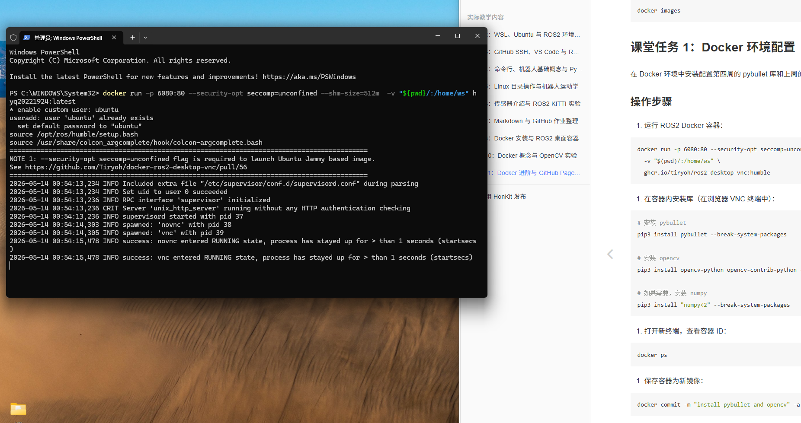

# Week 11：Docker 进阶与 GitHub Pages 网页部署

## 实验内容

本周完成了以下任务：

1.Docker 进阶指令
2.Docker 镜像更新与保存
3.GitHub Pages 网页部署完整指引
4.轮式机器人介绍

### 作业成果

## 学习心得

通过本周学习，我学会更新docker镜像，并且将自己的作业仓库转为网页

### 返回

[← 返回首页](../)