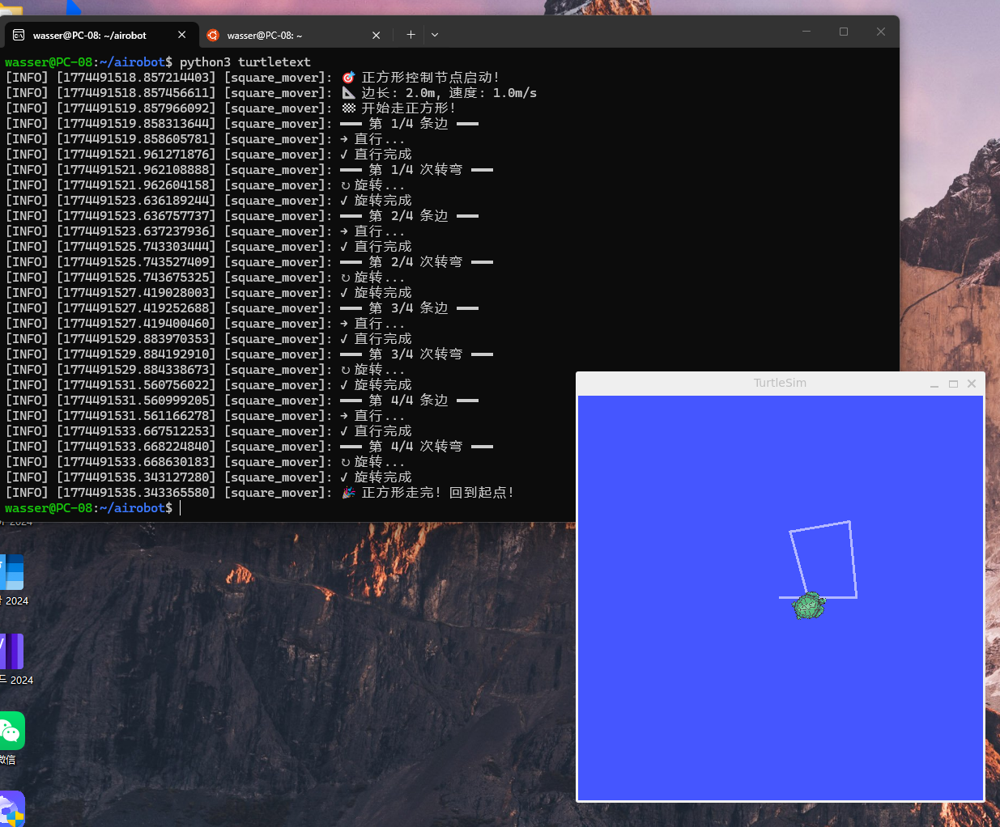

# Week 3：GitHub SSH、VS Code 与 ROS2 交互

## 实验内容

本周完成了以下任务：

1.设置github ssh密钥并进行ubuntu里的命令行交互
2.设置vs code 与wsl ubuntu交互
3.运行小乌龟节点，进行ros命令行交互

### 作业成果

## 学习心得

通过本周学习，我掌握了基础的交互指令，学会了链接仓库上传作业

### 返回

[← 返回首页](../)